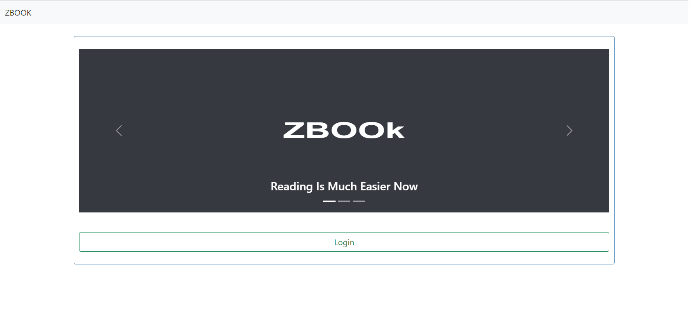
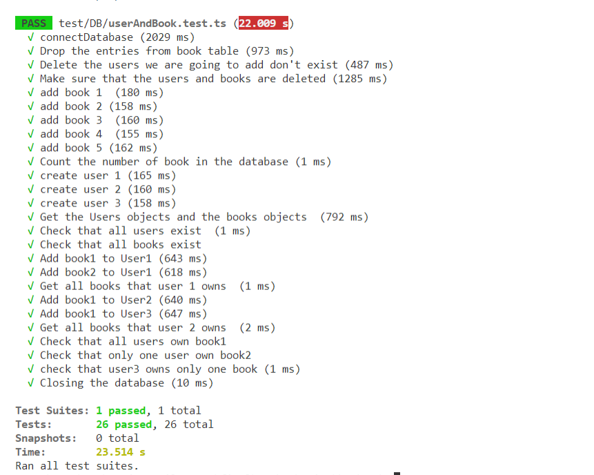

# Instructins to Run the app

The project is done using the following stack:  
1. Nodejs
2. MangoDB
3. Reactjs

## Instructions to Run the app

You have to run first the server(backend) and then running the 
application itself(frontend)

### Instructions to run the backend 
1. First go the /backend folder
2. Install the required packages.**(You have to download node.js to be able to run this app)**
    ```sh
    $ npm install
    ```
    
3. Run the server(It will listen to port 5000)
    ```sh
    $ npm start
    ```

### Instructions to run the Frontend (More details in the /frontend/readme.md file) 
1. Go to the ./frontend 
2. Install the required packages.
    ```sh
    $ npm install
    ```
    
3. Run the server(It will listen to port 3000)
    ```sh
    $ npm start
    ```

4. If everything went well, the website should automatically open


## Instructions to Run the tests
We made several tests to cover all of the requirements in the first milestone. They are found in the ./backend/test folder
To run them:
1. Go to the ./backend folder
2. Run the following command
    ```
    $ npm test
    ```

If everything went correctly, all tests should pass.

